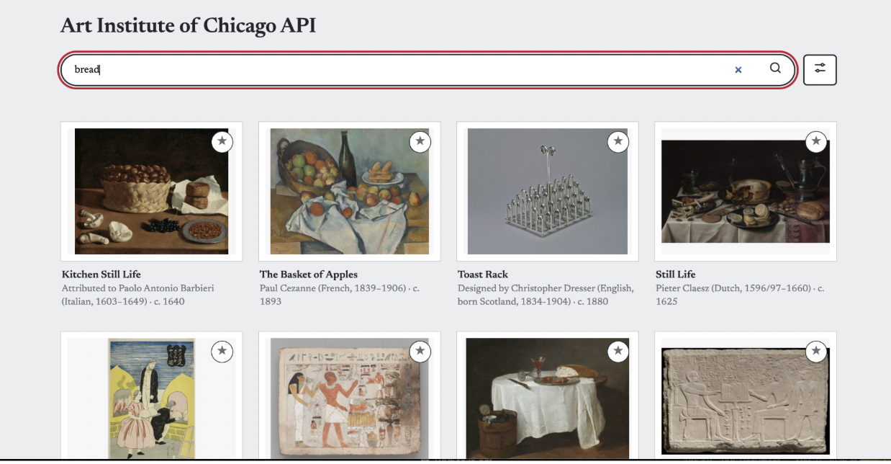

# Day 1 "before" snapshot

Write your own, even if you worked in a pair. Keep it: we come back to it at mid-quarter (Week 6) and at the end (Week 11). Your prompts go in `ai_log.md`, not here.

**Name: Won Kim**
**Partner (if any):**

## Before we prompted

### 1. Who is it for, and what do they want to do?

It's for Art students who want to search up artwork associated with the keyword and learn information about it
**"The user can..." sentences:**
1. Filter
2. Search
3. Favorite
4. Sort
for artwork

### 2. Our sketch

Put the photo in this `hw0` folder, then change the filename below to match:

### 3. Our prediction

We expected the app would...Be able to search for the artwork, and we will be able to use the filter for our desired artwork, and save our favorite artwork

## What we got

### 4. What the AI made

Put the screenshot in this `hw0` folder, then change the filename below to match:

### 5. Sketch vs. app

- **Matches our sketch:**Search bar, the website names, filter tab. Layout of the images

- **Different from our sketch:**it sometimes show irrelevant artwork

- **The AI decided** (something we never said):
Load more: a button at the bottom brings in the next batch. used this for the partial bottom row in your sketch.
Learn more: clicking an image opens a detail window. This wasn't in my sketch, but to learn about the artwork.

### 6. What did I keep, change, or reject, and why?

I kept most of the stuff, the app that AI created well reflected my sketch, but every row had 3 image, and I wanted 4 images to show in 1 row so I prompted it to change

### 7. Explain back

Pick one part of the code. In your own words, what does it do?

(lines 71–120):
search() asks the museum for artworks.
card() and draw() turn the results into framed pictures.
showInfo() fills the pop-up with details.

## Looking ahead

### 8. What does it do? Does it work? What broke?

when the user searches or filters, and shows results with images. It's for who want to search up artwork assoicated with the keyword and who want to learn information about it. It does its job pretty well, and nothing really broke while playing around with it.

### 9. How much do I understand about how it works? (0–100%)

**My number:** 70%

**Why that number:**
Because I get the gist of how it works but understanding code by code is bit difficult to comprehend.

### 10. What would I need to know to tell whether it's *well designed or well built*?

I think it mostly did what the prompt asked it to do, the user was able to search, sort, filter, favorite the artwork and navigate through the app. I think the app is well designed if it's not difficult to understand and use and it matches my sketch and the goal. Also, it is well built if the code is readable and it actually works.

### 11. What do I hope to be able to do by week 10?

I want to be able to create an well functioning app, effectively and be able to understand the coding work behind it too.